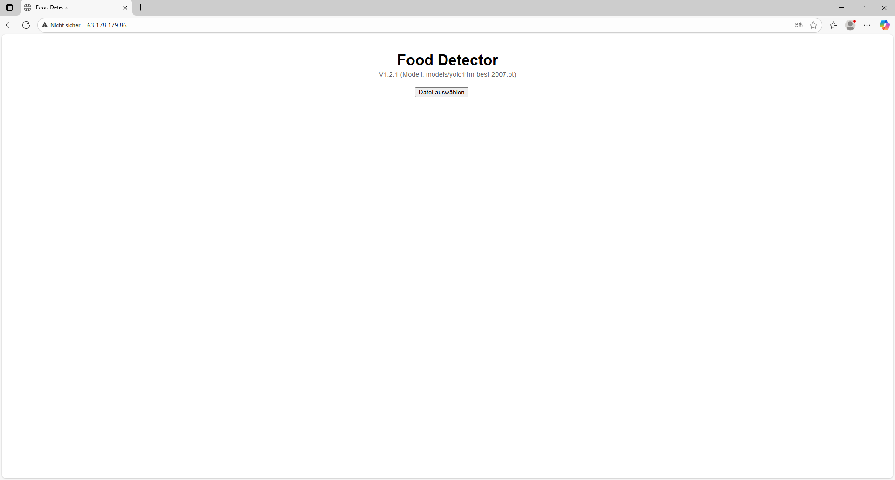
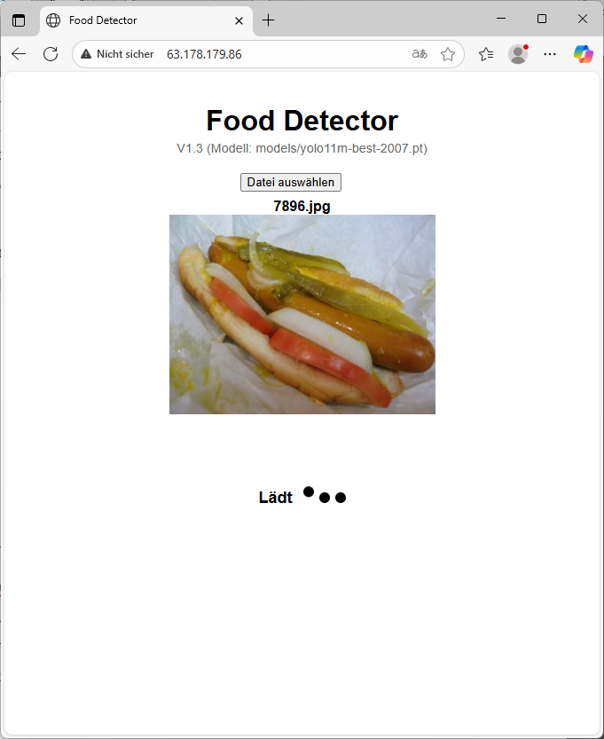
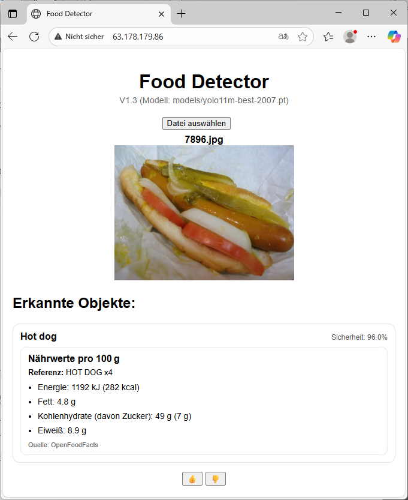
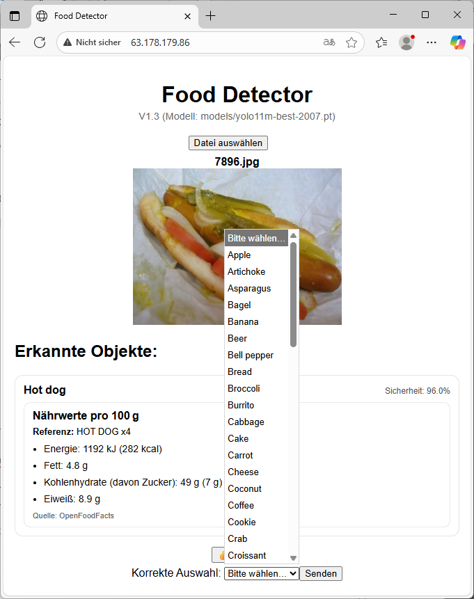
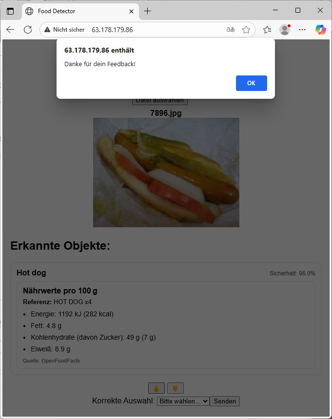

# 🍎 Food Detector App

Eine **webbasierte Anwendung zur bildgestützten Nährwertermittlung von Lebensmitteln**.  
Durch den Upload eines Fotos erkennt die App automatisch enthaltene Lebensmittel mittels **YOLO-Objekterkennung** und ergänzt diese mit **Nährwertdaten aus der OpenFoodFacts-Datenbank**.  
Entwickelt im Rahmen der Bachelorarbeit an der Hochschule Coburg (2025).

---

## 🚀 Features

- 📸 Upload von Lebensmittelbildern (Frontend)
- 🤖 Objekterkennung mit **YOLO** (Ultralytics)
- 🥗 Automatische Anreicherung mit Nährwerten (pro 100 g) aus **OpenFoodFacts**
- 💬 Feedback-Funktion zur Verbesserung der Erkennungen
- 🌐 Vollständig webbasiert (React-Frontend + FastAPI-Backend)

---

## 🖼️ Demo (Screenshot)

```md










## 🏗️ Architektur

Frontend (React, Vite)
|
| REST-API (JSON)
v
Backend (FastAPI, Python)
├── YOLO-Inferenz (ultralytics)
└── OpenFoodFacts-Client (HTTP-API)

Frontend: React (Vite) mit Komponentenstruktur (App, ImageUploader, ResultDisplay, FeedbackForm)
Backend: FastAPI mit Endpunkten /predict, /labels, /model-info, /feedback
Modelle: Ultralytics YOLO (Standardmodelle & eigene Fine-Tunes)

## ⚙️ Installation & Setup

1. Voraussetzungen:

- Node.js (>= 18)
- Python (>= 3.10)
- Git
- (optional) Virtuelle Umgebung für Python

2. Repository klonen
   git clone https://github.com/JohnnyM11/food-detector-app.git
   cd food-detector-app

3. Backend starten
   cd backend
   pip install -r requirements.txt
   uvicorn main:app --reload --host 0.0.0.0 --port 8000

4. Frontend starten
   cd frontend
   npm install
   npm run dev

Die App ist dann standardmäßig erreichbar unter:
👉 http://localhost:5173

## 📂 Projektstruktur

food-detector-app/
├── backend/
│ ├── main.py # FastAPI-Backend
│ ├── yolo_predict.py # YOLO-Inferenz
│ ├── openfoodfacts_client.py # OFF-API-Abfragen
│ └── models/ # Trainierte YOLO-Modelle
│
├── frontend/
│ ├── src/
│ │ ├── App.jsx # Hauptkomponente
│ │ ├── components/ # UI-Komponenten
│ │ └── styles/ # CSS-Dateien
│ └── index.html
│
├── deploy-to-ec2.sh # Deployment-Skript
└── README.md

## 🔍 Endpunkte (API)

POST /predict → führt YOLO-Inferenz aus, liefert erkannte Objekte + Nährwerte
POST /feedback → speichert Nutzer-Feedback als JSON

GET /labels → gibt verfügbare Modell-Labels zurück
GET /model-info → gibt den Namen des verwendeten Modells zurück

## 📊 Technologien

Frontend: React, Vite, JavaScript/JSX, CSS
Backend: FastAPI, Python
ML: Ultralytics YOLO
Datenquelle: OpenFoodFacts API
Deployment: AWS EC2

## 📖 Lizenz

Dieses Projekt wurde im Rahmen einer Bachelorarbeit an der Hochschule Coburg entwickelt.
Die Software ist zu Forschungs- und Demonstrationszwecken gedacht.
Eine kommerzielle Nutzung ist ohne Genehmigung nicht gestattet.

## 👨‍💻 Autor

Johnny Müller
B.Sc. Informatik, Hochschule Coburg
2025
```
